# Report

## Data Processing

### Preprocessing

```text
events.h5 → anti-kT R=1.0; leading pT > 1.2 TeV; two jets/event
          → ≤30 exclusive-kT subjets
          → unique-6 graph (ln ΔR, ln kT, ln z; normalized pT)
          → event_id split
```

### Dataset preparation

| Dataset | Train / validation | Evaluation | Role |
| ------- | ------------------ | ---------- | ---- |
| LHCO R&D | 80k / 20k background | 340k background + 20k signal | Main benchmark |
| Kitchen Sink | None | 20k signal + the same 340k LHCO background | Zero-shot transfer |
| BB1 | None | Full labeled sample | External and bump evaluation |

Kitchen Sink files contain signal only; evaluation background always comes
from held-out LHCO.

| KS signal | Directory | Prongs | Selected two-jet events |
| --------- | --------- | -----: | ----------------------: |
| WR | `XtoWRto3W` | 2+4 | 32,799 |
| YY | `XtoYYprime` | 2+2 | 44,673 |
| Zp | `ZpToTpTp` | 5+5 | 32,321 |
| YHH | `YtoHHto4T` | 6+6 | 48,077 |

Details: [pipeline and commands](README.md#default-lhco-pipeline) ·
[LHCO / KS / BB1 setup](materials/setup_lhco_ks.md).

## Baseline Model

All results below use the same Graph-AE baseline unless a section says
otherwise.

**Input.** Each jet is a graph of up to 30 $p_T$-ordered subjets. Nodes
carry $\ln p_T$ only. Edges are a unique-6 graph in $(\eta,\phi)$; each edge
has three log features

$$
\bigl(\ln\theta_{ij},\;\ln k_T,\;\ln z\bigr),
$$

with $\theta_{ij}=\Delta R_{ij}$,
$k_T=\min(p_{T,i},p_{T,j})\,\theta_{ij}$,
$z=\min(p_{T,i},p_{T,j})/(p_{T,i}+p_{T,j})$.

**Architecture.** Graph autoencoder, no BatchNorm; `hidden_dim=64`,
`latent_dim=2`, node input dim 1 ($\ln p_T$).

- **Encoder** (EdgeConv with edge features):  
  EB1(64) → EB2(64) → EB3(2) per-subjet latent $z$.
- **Node decoder** (EdgeConv on $[x_i\|x_j-x_i]$, no edge features):  
  DB1(32) → DB2(1) → $\hat{x}$.
- **Edge head:** MLP on the two latent endpoints → $\hat{e}$ (3-d).

The figure below is Figure 7 from Araz et al., [*Graph theory inspired anomaly
detection at the LHC*](https://arxiv.org/abs/2506.19920), and shows the Graph-AE
architecture used as our reference baseline.

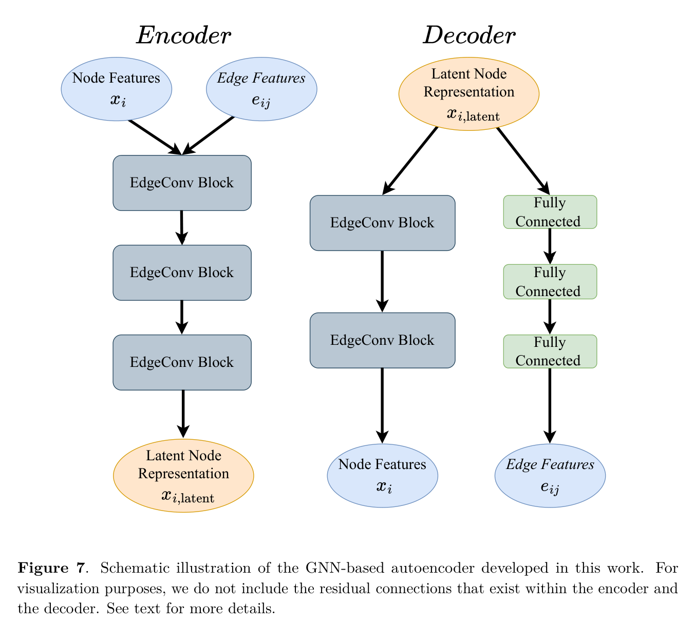

**Training.** Reconstruct nodes and edges on background (or lightly
contaminated) jets:

$$
\mathcal{L}_{\mathrm{recon}}
= \mathrm{MSE}(\hat{x},\,x) + \mathrm{MSE}(\hat{e},\,e).
$$

**Anomaly score.** Per-jet reconstruction error (same terms as training,
mean over that jet’s nodes/edges), then sum over the two jets in an event:

$$
s_{\mathrm{jet}}
= \mathrm{MSE}_{\mathrm{node}} + \mathrm{MSE}_{\mathrm{edge}},
\qquad
s_{\mathrm{event}}
= \sum_{\mathrm{jets\ in\ event}} s_{\mathrm{jet}}.
$$

## Baseline Experiments

### Improvements

**Jet selection.** Cutting both jets at $1.2$ TeV creates label bias: the
two-jet sample contains far more signal than the one-jet sample. We therefore
cut only the leading jet and require two usable jets, preventing jet count from
becoming an anomaly shortcut.

| Events after the per-jet cut | Events | Background | Signal | Signal fraction |
| ---------------------------- | -----: | ---------: | -----: | --------------: |
| Subleading jet removed: one jet retained | 54,034 | 51,238 | 2,796 | 5.17% |
| Subleading jet survives: two jets retained | 85,965 | 48,761 | 37,204 | 43.28% |

Using only the number of retained jets as the anomaly score already gives
an AUC of 0.7212, confirming the selection bias.

**Normalized $k_T$.** We compute $k_T$ using jet-normalized $p_T$ to remove the
overall energy scale.

### Baseline performance across datasets

- Pure-background Reference EdgeGraphAE, 50 epochs, last checkpoint.
- LHCO / KS: 340k held-out LHCO background + 20k signal events.
- BB1: 998,738 background + 834 signal events.

| Dataset | Signal structure | AUC | MaxSIC |
| ------- | ---------------- | --: | -----: |
| LHCO R&D | benchmark signal | **0.9098** | 2.311 |
| KS: $X\to WR\to3W$ | 2+4 prongs | 0.8838 | 1.979 |
| KS: $X\to YY'$ | 2+2 prongs | 0.8712 | 1.856 |
| KS: $Z'\to T'T'$ | 5+5 prongs | 0.8988 | 2.061 |
| KS: $Y\to HH\to4T$ | 6+6 prongs | 0.8986 | 2.050 |
| BB1 | hidden anomaly | 0.8891 | **2.484** |

#### Canonical baseline: 3% contamination

| Dataset | 0% AUC / MaxSIC | 3% AUC / MaxSIC |
| ------- | ----------------: | ----------------: |
| LHCO R&D | 0.9098 / 2.311 | 0.9065 / 2.263 |
| KS: $X\to WR\to3W$ | 0.8838 / 1.979 | 0.8827 / 1.970 |
| KS: $X\to YY'$ | 0.8712 / 1.856 | 0.8684 / 1.831 |
| KS: $Z'\to T'T'$ | 0.8988 / 2.061 | 0.9040 / 2.128 |
| KS: $Y\to HH\to4T$ | 0.8986 / 2.050 | 0.9047 / 2.113 |
| BB1 | 0.8891 / 2.484 | 0.8854 / 2.342 |

- **Result:** contamination slightly helps the two high-prong signals but
  lowers LHCO, WR, YY, and BB1.

### Graph construction variants

**Smoke-test setup**

- Train / validation: 5k / 1k background events.
- Test: 5k background + 1k signal events.
- Fixed: events, EdgeGraphAE, training budget, and event score.
- Varied: graph construction only.

| Graph | Mean edges / jet | LHCO AUC | MaxSIC |
| ----- | ---------------: | --------: | -----: |
| kNN-6 | 171.6 | 0.6079 | 1.059 |
| Symmetric kNN-8 | 311.7 | 0.6671 | 1.075 |
| Radius $R=0.2$ | 330.4 | 0.8931 | **2.537** |
| Radius $R=0.2$ + capped kNN-6 | 175.9 | 0.6936 | 1.153 |
| Unique-2 | 108.4 | 0.8670 | 1.886 |
| **Unique-6** | 301.2 | **0.9053** | 2.304 |
| Minimum spanning tree | 55.2 | 0.6613 | 1.123 |
| Delaunay | 153.1 | 0.7122 | 1.151 |
| Fully connected | 802.3 | 0.8977 | 2.338 |

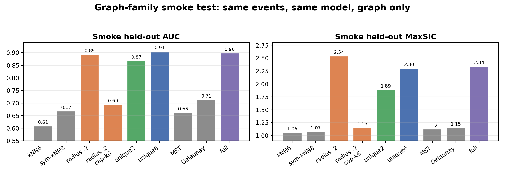

### GNN variants (full data)

- Varied: encoder message-passing backbone only: GCN, GraphSAGE, GATv2, GIN,
  and TransformerConv.

| Model | Training signal | LHCO AUC | MaxSIC |
| ----- | --------------: | -------: | -----: |
| Baseline (EdgeConv) | 0% | 0.9098 | 2.311 |
| GCN | 0% | 0.9027 | 2.543 |
| GraphSAGE | 0% | 0.9015 | 2.297 |
| GATv2 | 0% | 0.8994 | 2.456 |
| GIN | 0% | 0.9024 | 2.290 |
| TransformerConv | 0% | 0.8975 | 2.381 |


## Bump Plot

### Settings

All three runs below are **pure-background** Graph-AE training:

- **No 3% S/B contamination**
- Window replacement (keep the 80k / 20k counts by swapping in unused
out-of-window background):
  - Exclude 3600–4000: replaced **6,251** train-bkg + **1,540** val-bkg;
  - Exclude 3000–4300: replaced **28,518** train-bkg + **7,100** val-bkg.
- Model: EdgeGraphAE / unique-6 / 30 subjets / log edge features,
`hidden_dim=64`, `latent_dim=2`, no BatchNorm, 50 epochs, seed 123.

### Metrics summary


| Setting           | Train/val mJJ exclusion | LHCO AUC / MaxSIC | BB1 AUC / MaxSIC |
| ----------------- | ----------------------- | ----------------- | ---------------- |
| No mJJ exclude    | none                    | 0.9098 / 2.311    | 0.8891 / 2.484   |
| Exclude 3600–4000 | `3600 ≤ mJJ < 4000` GeV | 0.9103 / 2.319    | 0.8910 / 2.404   |
| Exclude 3000–4300 | `3000 ≤ mJJ < 4300` GeV | 0.9129 / 2.357    | 0.8931 / 2.561   |


For each exclusion setting, in-window train/val background events are replaced
as listed under Settings; training remains pure background.

### Training curves

Train loss, val loss, and monitor AUROC over 50 epochs for the three
pure-background runs above (loss panels start at epoch ≥ 3 to skip the shared
epoch-1 spike).

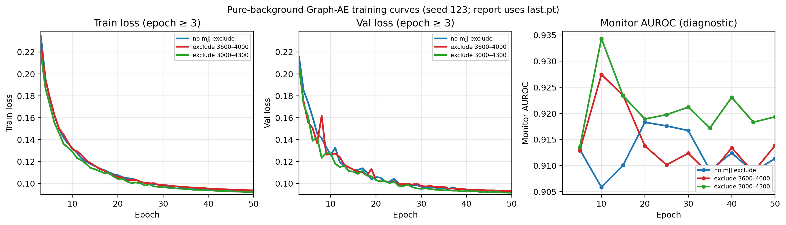


### BB1 top anomaly-score selections

BB1 $m_{JJ}$ distributions of events in the top anomaly-score fraction
(1% → 0.01%), comparing the three pure-background trainings above
(`last.pt`; 100 GeV bins, Gaussian-smoothed).

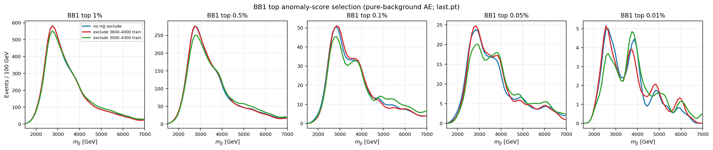


#### Exclude `3600 ≤ mJJ < 4000`

Baseline vs window-excluded training; shaded band marks the excluded train window.

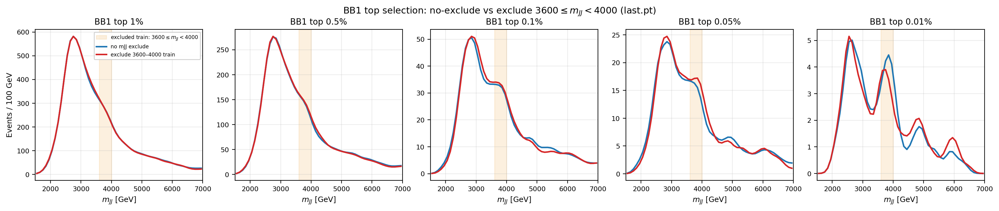


#### Exclude `3000 ≤ mJJ < 4300`

Baseline vs window-excluded training; shaded band marks the excluded train window.

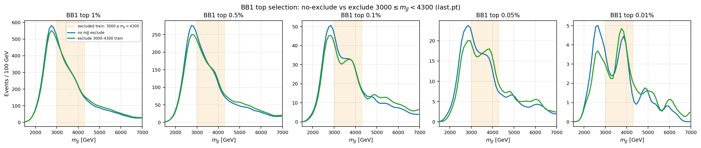


#### No-mJJ-exclude truth decomposition

Top-score selection for the all-mass baseline, split with BB1 truth labels into
real anomaly within the selection and the residual (selected minus real anomaly).
Truth is used only for this diagnostic decomposition.

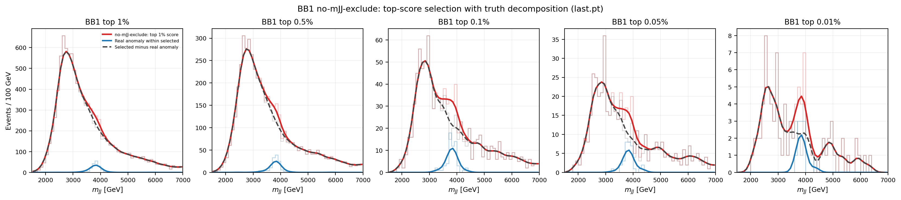


#### No $m_{JJ}$ exclude: 0% vs 3% contamination


#### Exclude `3600 ≤ mJJ < 4000` truth decomposition

Same top-score + truth split for the window-excluded training.

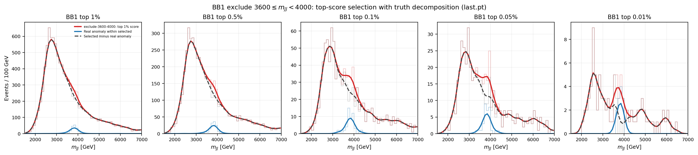


#### Exclude `3000 ≤ mJJ < 4300` truth decomposition

Same top-score + truth split for the wider window-excluded training.

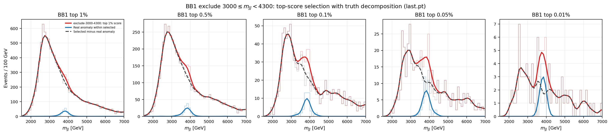


## Adjacent-Subjet Regularization


### Idea

Adjacent-subjet regularization adds a second training term: for subjet pairs that share a graph edge, penalize the distance between their internal representations $z$ (taken from an encoder EdgeBlock):

$$
\mathcal{L}=\mathcal{L}_{\mathrm{recon}}+\lambda\,\mathcal{R}(E,z),\qquad \mathcal{R}=\frac{1}{N}\sum_{(i,j)\in E}\lVert z_i-z_j\rVert.
$$


### Variants

Same $\mathcal{R}$; only **which encoder EdgeBlock** provides $z$, and
**how** the adjacent set $E$ is chosen:

```
subjet input → EB1(64) → EB2(64) → EB3(2) → decoder
                              ↑         ↑
                              │         ├─ unique_EB3_sum
                              │         └─ graph_EB3_sum
                              │
                     unique_EB2_sum
```

| Name | $z$ | How $E$ is built |
|------|-----|------------------|
| `unique_EB2_sum` | EB2 (64-d) | Rebuild unique-6 using distances in **detached** $z$ |
| `unique_EB3_sum` | EB3 latent (2-d) | Same: rebuild unique-6 on detached $z$ |
| `graph_EB3_sum` | EB3 latent (2-d) | Use the dataset’s fixed unique-6 `edge_index` (no rebuild) |

For `unique_EB*`：each step treats the current $z_i$ as coordinates, runs the
same unique-6 rule as the input graph (stop-grad on the choice of pairs),
then measures **live** $\|z_i-z_j\|$ on those pairs. So “who is adjacent”
follows the latent geometry; only the distances get gradients.

For `graph_EB3_sum`：adjacency stays the physical unique-6 edges already used
for message passing; only the latent distances along those edges are
penalized.


### Fine-tune

#### Settings

- Start from the frozen baseline `last.pt` (0%: pure-bkg mJJ-window
  reference; 3%: same architecture trained with 3% signal).
- Objective: $\mathcal{L}_{\mathrm{recon}}+\lambda\mathcal{R}$ with
  $\lambda=1$.
- 5 epochs, lr $3\times10^{-4}$, 40k train jets from the training split.
- Anomaly score unchanged (reconstruction only); tables use the fine-tuned
  checkpoint on full LHCO test / BB1.

#### Training curves

Train reconstruction and $\mathcal{R}$ over the 5 fine-tune epochs (no
per-epoch AUROC during fine-tune).


#### LHCO


| Regularizer            | Signal % | AUC   | MaxSIC | $\varepsilon_S$ @ $10^{-2}$ |
| ---------------------- | -------- | ----- | ------ | --------------------------- |
| baseline               | 0%       | 0.910 | 2.32   | 0.198                       |
| baseline               | 3%       | 0.907 | 2.26   | 0.189                       |
| `unique_EB3_sum`       | 0%       | 0.926 | 2.94   | 0.279                       |
| `unique_EB3_sum`       | 3%       | 0.920 | 2.80   | 0.266                       |
| `unique_EB2_sum`       | 0%       | 0.920 | 2.81   | 0.276                       |
| `unique_EB2_sum`       | 3%       | 0.920 | 2.74   | 0.249                       |
| `graph_EB3_sum`            | 0%       | 0.926 | 3.06   | 0.295                       |
| `graph_EB3_sum`            | 3%       | 0.887 | 2.21   | 0.188                       |


#### BB1


| Regularizer            | Signal % | AUC   | MaxSIC | $\varepsilon_S$ @ $10^{-2}$ |
| ---------------------- | -------- | ----- | ------ | --------------------------- |
| baseline               | 0%       | 0.891 | 2.40   | 0.236                       |
| baseline               | 3%       | 0.885 | 2.34   | 0.222                       |
| `unique_EB3_sum`       | 0%       | 0.923 | 3.87   | 0.355                       |
| `unique_EB3_sum`       | 3%       | 0.921 | 3.86   | 0.357                       |
| `unique_EB2_sum`       | 0%       | 0.916 | 3.55   | 0.347                       |
| `unique_EB2_sum`       | 3%       | 0.924 | 4.13   | 0.383                       |
| `graph_EB3_sum`            | 0%       | 0.923 | 4.01   | 0.382                       |
| `graph_EB3_sum`            | 3%       | 0.893 | 2.76   | 0.269                       |


#### Kitchen Sink

Zero-shot Kitchen Sink signals vs held-out LHCO background
(340k bkg : 20k signal, event score `sum`). Same checkpoints as LHCO / BB1.


| Regularizer            | Signal % | X→WR→3W AUC / MaxSIC | X→YY′ AUC / MaxSIC | Z′→T′T′ AUC / MaxSIC | Y→HH→4T AUC / MaxSIC |
| ---------------------- | -------- | --------------------- | --------------------- | --------------------- | --------------------- |
| baseline               | 0%       | 0.884 / 1.97 | 0.873 / 1.86 | 0.902 / 2.09 | 0.902 / 2.08 |
| baseline               | 3%       | 0.883 / 1.95 | 0.868 / 1.82 | 0.899 / 2.07 | 0.900 / 2.07 |
| `unique_EB3_sum`       | 0%       | 0.892 / 2.10 | 0.886 / 2.18 | 0.881 / 1.88 | 0.849 / 1.68 |
| `unique_EB3_sum`       | 3%       | 0.882 / 1.99 | 0.876 / 2.08 | 0.859 / 1.72 | 0.806 / 1.48 |
| `unique_EB2_sum`       | 0%       | 0.880 / 1.97 | 0.882 / 2.21 | 0.877 / 1.83 | 0.853 / 1.72 |
| `unique_EB2_sum`       | 3%       | 0.883 / 1.98 | 0.878 / 2.16 | 0.861 / 1.73 | 0.794 / 1.47 |
| `graph_EB3_sum`        | 0%       | 0.890 / 2.11 | 0.884 / 2.27 | 0.845 / 1.63 | 0.770 / 1.37 |
| `graph_EB3_sum`        | 3%       | 0.840 / 1.62 | 0.828 / 1.61 | 0.670 / 1.15 | 0.539 / 1.06 |

**0% training**

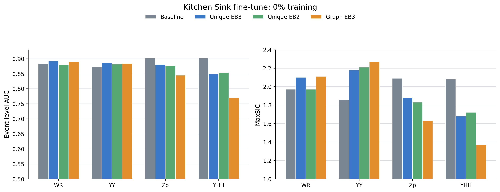

**3% contamination**

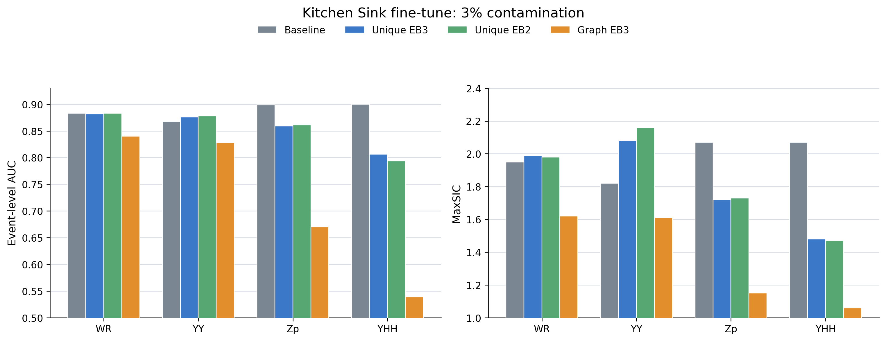


### From-scratch

#### Settings

- Train from random init with the same baseline architecture and data
  splits as the corresponding frozen run (0% or 3% signal).
- Objective: $\mathcal{L}_{\mathrm{recon}}+\lambda\mathcal{R}$ with
  $\lambda=1$, 50 epochs, OneCycle, `last.pt` for metrics.
- Train/val curves below show **reconstruction** loss only; monitor AUROC
  is diagnostic.

#### Training curves


#### LHCO


| Regularizer            | Signal % | AUC   | MaxSIC | $\varepsilon_S$ @ $10^{-2}$ |
| ---------------------- | -------- | ----- | ------ | --------------------------- |
| baseline               | 0%       | 0.910 | 2.32   | 0.198                       |
| baseline               | 3%       | 0.907 | 2.26   | 0.189                       |
| `unique_EB3_sum`       | 0%       | 0.916 | 2.55   | 0.228                       |
| `unique_EB3_sum`       | 3%       | 0.917 | 2.58   | 0.234                       |
| `unique_EB2_sum`       | 0%       | 0.919 | 2.80   | 0.270                       |
| `unique_EB2_sum`       | 3%       | 0.906 | 2.32   | 0.173                       |
| `graph_EB3_sum`            | 0%       | 0.919 | 2.66   | 0.242                       |
| `graph_EB3_sum`            | 3%       | 0.918 | 2.63   | 0.233                       |


#### BB1


| Regularizer            | Signal % | AUC   | MaxSIC | $\varepsilon_S$ @ $10^{-2}$ |
| ---------------------- | -------- | ----- | ------ | --------------------------- |
| baseline               | 0%       | 0.891 | 2.40   | 0.236                       |
| baseline               | 3%       | 0.885 | 2.34   | 0.222                       |
| `unique_EB3_sum`       | 0%       | 0.913 | 3.32   | 0.312                       |
| `unique_EB3_sum`       | 3%       | 0.916 | 3.56   | 0.320                       |
| `unique_EB2_sum`       | 0%       | 0.913 | 3.57   | 0.321                       |
| `unique_EB2_sum`       | 3%       | 0.899 | 2.63   | 0.198                       |
| `graph_EB3_sum`            | 0%       | 0.917 | 3.55   | 0.330                       |
| `graph_EB3_sum`            | 3%       | 0.917 | 3.58   | 0.338                       |

#### Kitchen Sink

Zero-shot Kitchen Sink signals vs held-out LHCO background
(340k bkg : 20k signal, event score `sum`). Same checkpoints as LHCO / BB1.


| Regularizer            | Signal % | X→WR→3W AUC / MaxSIC | X→YY′ AUC / MaxSIC | Z′→T′T′ AUC / MaxSIC | Y→HH→4T AUC / MaxSIC |
| ---------------------- | -------- | --------------------- | --------------------- | --------------------- | --------------------- |
| baseline               | 0%       | 0.884 / 1.97 | 0.873 / 1.86 | 0.902 / 2.09 | 0.902 / 2.08 |
| baseline               | 3%       | 0.883 / 1.95 | 0.868 / 1.82 | 0.899 / 2.07 | 0.900 / 2.07 |
| `unique_EB3_sum`       | 0%       | 0.878 / 1.93 | 0.875 / 2.00 | 0.897 / 2.01 | 0.873 / 1.83 |
| `unique_EB3_sum`       | 3%       | 0.875 / 1.89 | 0.873 / 1.95 | 0.894 / 1.98 | 0.868 / 1.81 |
| `unique_EB2_sum`       | 0%       | 0.880 / 1.94 | 0.882 / 2.12 | 0.863 / 1.75 | 0.821 / 1.58 |
| `unique_EB2_sum`       | 3%       | 0.858 / 1.73 | 0.864 / 1.79 | 0.845 / 1.66 | 0.851 / 1.71 |
| `graph_EB3_sum`        | 0%       | 0.880 / 1.94 | 0.877 / 2.02 | 0.890 / 1.94 | 0.860 / 1.76 |
| `graph_EB3_sum`        | 3%       | 0.878 / 1.92 | 0.876 / 2.01 | 0.897 / 2.00 | 0.870 / 1.82 |

**0% training**

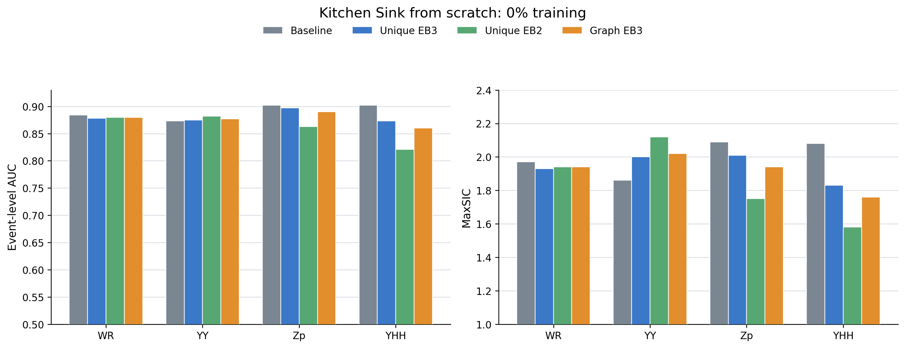

**3% contamination**

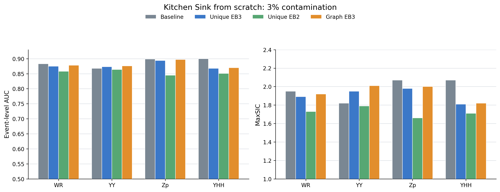


## Kitchen Sink Follow-up Experiments

The initial attraction regularizer pulls connected subjets together, erasing
multi-branch structure in complex Kitchen Sink signals.

### Strong topology attraction

**Method.** Unlike from-scratch training, all variants start from the trained
baseline checkpoint, then fine-tune EB2, EB3, or both with graph-edge
attraction.

$$
\mathcal L=\mathcal L_{\rm rec}+\sum_{\ell\in\{\mathrm{EB2,EB3}\}}
\lambda_\ell\,\frac{1}{N}\sum_{(i,j)\in E}\lVert z_i^\ell-z_j^\ell\rVert_2.
$$

| Model | WR | YY | Zp | YHH | LHCO | BB1 |
| ----- | -: | -: | -: | --: | ---: | --: |
| Baseline: reconstruction only | 0.884 | 0.873 | **0.902** | **0.902** | 0.910 | 0.891 |
| EB2 only | 0.876 | 0.878 | 0.871 | 0.827 | 0.914 | 0.912 |
| EB3 only | 0.890 | 0.884 | 0.845 | 0.770 | 0.926 | 0.923 |
| EB2 + EB3 | **0.898** | **0.895** | 0.864 | 0.791 | **0.930** | **0.926** |

**Result.** EB3 drives most of the compact-signal gain; adding EB2 gives the
best WR, YY, LHCO, and BB1 scores, but still suppresses Zp and YHH.

### Event-wise gated scoring

**Method.** Convert the strong-attraction and baseline scores to background
quantiles, then combine them with an input-only gate.

$$
Q_k(e)=\mathrm{Percentile}_{\mathrm{bkg}}(s_k(e)),
\qquad k\in\{\mathrm{strong},\mathrm{baseline}\}.
$$

For each jet, $p_i$ is the normalized $p_T$ weight of subjet $i$, analogous
to a state-occupation probability.

$$
p_i=\frac{p_{T,i}}{\sum_m p_{T,m}}.
$$

$\mathrm{PR}_j$ is the normalized participation ratio of jet $j$.

$$
\mathrm{PR}_j=\frac{1}{N_j\sum_{i\in j}p_i^2}.
$$

The input graph stores each subjet at
$\mathbf r_i=(\Delta\eta_i,\Delta\phi_i)$ relative to the $p_T$-weighted jet
axis; $r_{{\rm rms},j}$ is the corresponding RMS radius.

$$
r_{{\rm rms},j}=\sqrt{\sum_{i\in j}p_i\lVert\mathbf r_i\rVert_2^2}.
$$

We standardize both observables using background centers and scales, then
average them into the structural coordinate $\chi_j$.

$$
\chi_j=\frac{1}{2}\left(\frac{\mathrm{PR}_j-\mu_{\rm PR}}{a_{\rm PR}}+\frac{r_{{\rm rms},j}-\mu_r}{a_r}\right).
$$

The gate averages the two jet weights; compact jets have lower $\chi_j$ and
therefore receive more strong-attraction weight.

$$
g(e)=\frac{1}{2}\sum_{j\in e}
\sigma\left(\frac{\tau-\chi_j}{T}\right).
$$

The final anomaly score is a weighted average: $g(e)$ weights the
strong-attraction score, and $1-g(e)$ weights the baseline score.

$$
s_{\rm gated}(e)=g(e)Q_{\rm strong}(e)+[1-g(e)]Q_{\rm baseline}(e).
$$

The two branches are EB2+EB3 strong attraction and the EdgeConv baseline.
Each row uses models trained at the stated contamination level. Percentiles
use pure validation background. We use $\tau=0.5$ and $T=0.25$.

| Training signal | WR | YY | Zp | YHH | LHCO | BB1 |
| --------------: | -: | -: | -: | --: | ---: | --: |
| 0% | 0.908 | 0.899 | 0.913 | 0.901 | 0.935 | 0.921 |
| 3% | 0.897 | 0.886 | 0.909 | 0.899 | 0.927 | 0.917 |

The method requires two models.

#### Parameter sensitivity

We vary only the gate threshold $\tau$, fixing $T=0.25$, both models, the data
split, and percentile calibration. All entries are AUC.

**0% training**

| Model | $\tau$ | WR | YY | Zp | YHH | LHCO | BB1 |
| ----- | -----: | -: | -: | -: | --: | ---: | --: |
| Baseline | n/a | 0.8843 | 0.8728 | 0.9022 | 0.9018 | 0.9103 | 0.8910 |
| Strong attraction | n/a | 0.8984 | 0.8952 | 0.8635 | 0.7912 | 0.9298 | 0.9264 |
| Gated | 0.250 | 0.9073 | 0.8968 | 0.9166 | 0.9120 | 0.9330 | 0.9162 |
| Gated | 0.375 | 0.9079 | 0.8979 | 0.9151 | 0.9075 | 0.9341 | 0.9184 |
| Gated | 0.400 | 0.9080 | 0.8981 | 0.9146 | 0.9064 | 0.9343 | 0.9188 |
| Gated | 0.425 | 0.9080 | 0.8982 | 0.9142 | 0.9052 | 0.9345 | 0.9193 |
| Gated | 0.450 | 0.9081 | 0.8984 | 0.9137 | 0.9039 | 0.9347 | 0.9197 |
| Gated | 0.475 | 0.9081 | 0.8986 | 0.9131 | 0.9026 | 0.9349 | 0.9201 |
| Gated | 0.500 | 0.9081 | 0.8987 | 0.9126 | 0.9011 | 0.9350 | 0.9205 |
| Gated | 0.750 | 0.9078 | 0.8997 | 0.9050 | 0.8823 | 0.9359 | 0.9239 |

**3% contamination**

| Model | $\tau$ | WR | YY | Zp | YHH | LHCO | BB1 |
| ----- | -----: | -: | -: | -: | --: | ---: | --: |
| Baseline | n/a | 0.8826 | 0.8681 | 0.8995 | 0.8999 | 0.9067 | 0.8854 |
| Strong attraction | n/a | 0.8826 | 0.8779 | 0.8610 | 0.7937 | 0.9196 | 0.9236 |
| Gated | 0.250 | 0.8977 | 0.8850 | 0.9133 | 0.9096 | 0.9259 | 0.9122 |
| Gated | 0.375 | 0.8976 | 0.8854 | 0.9115 | 0.9052 | 0.9268 | 0.9146 |
| Gated | 0.400 | 0.8975 | 0.8854 | 0.9111 | 0.9041 | 0.9270 | 0.9151 |
| Gated | 0.425 | 0.8975 | 0.8855 | 0.9106 | 0.9029 | 0.9271 | 0.9156 |
| Gated | 0.450 | 0.8974 | 0.8855 | 0.9101 | 0.9016 | 0.9272 | 0.9160 |
| Gated | 0.475 | 0.8973 | 0.8855 | 0.9095 | 0.9003 | 0.9273 | 0.9165 |
| Gated | 0.500 | 0.8972 | 0.8855 | 0.9089 | 0.8989 | 0.9274 | 0.9169 |
| Gated | 0.750 | 0.8957 | 0.8854 | 0.9013 | 0.8805 | 0.9279 | 0.9207 |

**Result.** In both settings, larger $\tau$ improves LHCO and BB1 but lowers
Zp and YHH. WR and YY change little. We use $\tau=0.5$.

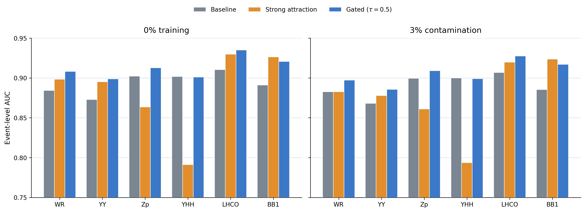

#### BB1 bump plots

Top: baseline versus gated scoring. Bottom: selected events split into real
anomaly and selected background.

**0% training**

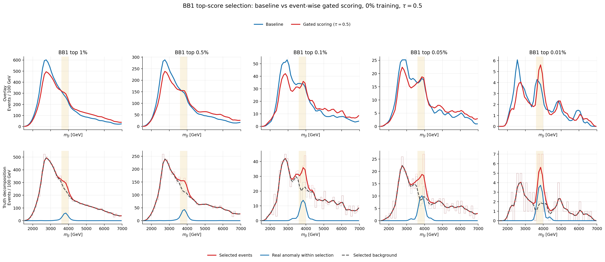

**3% contamination**

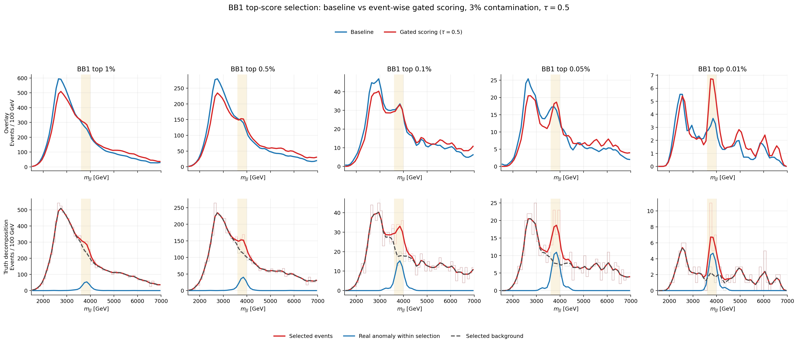
