# Report

## Baseline Model

All results below use the same Graph-AE baseline unless a section says
otherwise.

**Input.** Each jet is a graph of up to 30 $p_T$-ordered subjets. Nodes
carry $p_T$ only. Edges are a unique-6 graph in $(\eta,\phi)$; each edge
has three log features

$$
\bigl(\ln\theta_{ij},\;\ln k_T,\;\ln z\bigr),
$$

with $\theta_{ij}=\Delta R_{ij}$,
$k_T=\min(p_{T,i},p_{T,j})\,\theta_{ij}$,
$z=\min(p_{T,i},p_{T,j})/(p_{T,i}+p_{T,j})$.

**Architecture.** Graph autoencoder, no BatchNorm; `hidden_dim=64`,
`latent_dim=2`, node input dim 1 ($p_T$).

- **Encoder** (EdgeConv with edge features):  
  EB1(64) → EB2(64) → EB3(2) per-subjet latent $z$.
- **Node decoder** (EdgeConv on $[x_i\|x_j-x_i]$, no edge features):  
  DB1(32) → DB2(1) → $\hat{x}$.
- **Edge head:** MLP on the two latent endpoints → $\hat{e}$ (3-d).

```
subjet graph
    → EB1(64) → EB2(64) → EB3(2) = z
                              ├─→ DB1(32) → DB2(1) = x̂
                              └─→ edge MLP = ê
```

**Training.** Reconstruct nodes and edges on background (or lightly
contaminated) jets:

$$
\mathcal{L}_{\mathrm{recon}}
= \mathrm{MSE}(\hat{x},\,x) + \mathrm{MSE}(\hat{e},\,e).
$$

**Anomaly score.** Per-jet reconstruction error (same terms as training,
mean over that jet’s nodes/edges), then sum over the two jets in an event:

$$
s_{\mathrm{jet}}
= \mathrm{MSE}_{\mathrm{node}} + \mathrm{MSE}_{\mathrm{edge}},
\qquad
s_{\mathrm{event}}
= \sum_{\mathrm{jets\ in\ event}} s_{\mathrm{jet}}.
$$


## Bump Plot

### Settings

All three runs below are **pure-background** Graph-AE training:

- **No 3% S/B contamination**
- Window replacement (keep the 80k / 20k counts by swapping in unused
out-of-window background):
  - Exclude 3600–4000: replaced **6,251** train-bkg + **1,540** val-bkg;
  - Exclude 3000–4300: replaced **28,518** train-bkg + **7,100** val-bkg.
- Model: EdgeGraphAE / unique-6 / 30 subjets / log edge features,
`hidden_dim=64`, `latent_dim=2`, no BatchNorm, 50 epochs, seed 123.

### Metrics summary


| Setting           | Train/val mJJ exclusion | LHCO AUC / MaxSIC | BB1 AUC / MaxSIC |
| ----------------- | ----------------------- | ----------------- | ---------------- |
| No mJJ exclude    | none                    | 0.9098 / 2.311    | 0.8891 / 2.484   |
| Exclude 3600–4000 | `3600 ≤ mJJ < 4000` GeV | 0.9103 / 2.319    | 0.8910 / 2.404   |
| Exclude 3000–4300 | `3000 ≤ mJJ < 4300` GeV | 0.9129 / 2.357    | 0.8931 / 2.561   |


For each exclusion setting, in-window train/val background events are replaced
as listed under Settings; training remains pure background.

### Training curves

Train loss, val loss, and monitor AUROC over 50 epochs for the three
pure-background runs above (loss panels start at epoch ≥ 3 to skip the shared
epoch-1 spike). Monitor AUROC is diagnostic only; reported metrics and BB1
plots use `last.pt`.

Figure: `[figs/training_loss_auroc_threeway.png](figs/training_loss_auroc_threeway.png)`


### BB1 top anomaly-score selections

BB1 $m_{JJ}$ distributions of events in the top anomaly-score fraction
(1% → 0.01%), comparing the three pure-background trainings above
(`last.pt`; 100 GeV bins, Gaussian-smoothed).

Figure: `[figs/bb1_threeway_top1_to_0p01_row.png](figs/bb1_threeway_top1_to_0p01_row.png)`


#### Exclude `3600 ≤ mJJ < 4000`

Baseline vs window-excluded training; shaded band marks the excluded train window.

Figure: `[figs/bb1_exclude3600_4000_top1_to_0p01_row.png](figs/bb1_exclude3600_4000_top1_to_0p01_row.png)`


#### Exclude `3000 ≤ mJJ < 4300`

Baseline vs window-excluded training; shaded band marks the excluded train window.

Figure: `[figs/bb1_exclude3000_4300_top1_to_0p01_row.png](figs/bb1_exclude3000_4300_top1_to_0p01_row.png)`


#### No-mJJ-exclude truth decomposition

Top-score selection for the all-mass baseline, split with BB1 truth labels into
real anomaly within the selection and the residual (selected minus real anomaly).
Truth is used only for this diagnostic decomposition.

Figure: `[figs/bb1_noexclude_truth_decomp_top1_to_0p01_row.png](figs/bb1_noexclude_truth_decomp_top1_to_0p01_row.png)`


#### Exclude `3600 ≤ mJJ < 4000` truth decomposition

Same top-score + truth split for the window-excluded training.

Figure: `[figs/bb1_exclude3600_4000_truth_decomp_top1_to_0p01_row.png](figs/bb1_exclude3600_4000_truth_decomp_top1_to_0p01_row.png)`


#### Exclude `3000 ≤ mJJ < 4300` truth decomposition

Same top-score + truth split for the wider window-excluded training.

Figure: `[figs/bb1_exclude3000_4300_truth_decomp_top1_to_0p01_row.png](figs/bb1_exclude3000_4300_truth_decomp_top1_to_0p01_row.png)`


## Adjacent-Subjet Regularization


### Idea

Adjacent-subjet regularization adds a second training term: for subjet pairs that share a graph edge, penalize the distance between their internal representations $z$ (taken from an encoder EdgeBlock):

$$
\mathcal{L}
= \mathcal{L}_{\mathrm{recon}}
+ \lambda\,\mathcal{R}(E,\,z),
\qquad
\mathcal{R}
= \frac{1}{N}\sum_{(i,j)\in E}\|z_i-z_j\|.
$$


### Variants

Same $\mathcal{R}$; only **which encoder EdgeBlock** provides $z$, and
**how** the adjacent set $E$ is chosen:

```
subjet input → EB1(64) → EB2(64) → EB3(2) → decoder
                              ↑         ↑
                              │         ├─ unique_EB3_sum
                              │         └─ graph_EB3_sum
                              │
                     unique_EB2_sum
```

| Name | $z$ | How $E$ is built |
|------|-----|------------------|
| `unique_EB2_sum` | EB2 (64-d) | Rebuild unique-6 using distances in **detached** $z$ |
| `unique_EB3_sum` | EB3 latent (2-d) | Same: rebuild unique-6 on detached $z$ |
| `graph_EB3_sum` | EB3 latent (2-d) | Use the dataset’s fixed unique-6 `edge_index` (no rebuild) |

For `unique_EB*`：each step treats the current $z_i$ as coordinates, runs the
same unique-6 rule as the input graph (stop-grad on the choice of pairs),
then measures **live** $\|z_i-z_j\|$ on those pairs. So “who is adjacent”
follows the latent geometry; only the distances get gradients.

For `graph_EB3_sum`：adjacency stays the physical unique-6 edges already used
for message passing; only the latent distances along those edges are
penalized.


### Fine-tune

#### Settings

- Start from the frozen baseline `last.pt` (0%: pure-bkg mJJ-window
  reference; 3%: same architecture trained with 3% signal).
- Objective: $\mathcal{L}_{\mathrm{recon}}+\lambda\mathcal{R}$ with
  $\lambda=1$.
- 5 epochs, lr $3\times10^{-4}$, 40k train jets from the training split.
- Anomaly score unchanged (reconstruction only); tables use the fine-tuned
  checkpoint on full LHCO test / BB1.

#### Training curves

Train reconstruction and $\mathcal{R}$ over the 5 fine-tune epochs (no
per-epoch AUROC during fine-tune).

Figure: [`figs/adj_subjet_finetune_loss.png`](figs/adj_subjet_finetune_loss.png)

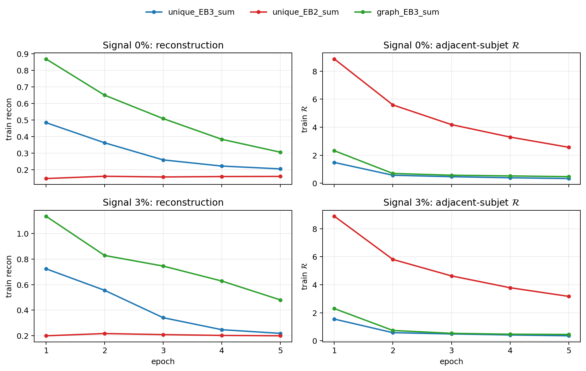

#### LHCO


| Regularizer            | Signal % | AUC   | MaxSIC | $\varepsilon_S$ @ $10^{-2}$ |
| ---------------------- | -------- | ----- | ------ | --------------------------- |
| baseline (no adj. reg) | 0%       | 0.910 | 2.32   | 0.198                       |
| baseline (no adj. reg) | 3%       | 0.907 | 2.26   | 0.189                       |
| `unique_EB3_sum`       | 0%       | 0.926 | 2.94   | 0.279                       |
| `unique_EB3_sum`       | 3%       | 0.920 | 2.80   | 0.266                       |
| `unique_EB2_sum`       | 0%       | 0.920 | 2.81   | 0.276                       |
| `unique_EB2_sum`       | 3%       | 0.920 | 2.74   | 0.249                       |
| `graph_EB3_sum`            | 0%       | 0.926 | 3.06   | 0.295                       |
| `graph_EB3_sum`            | 3%       | 0.887 | 2.21   | 0.188                       |


#### BB1


| Regularizer            | Signal % | AUC   | MaxSIC | $\varepsilon_S$ @ $10^{-2}$ |
| ---------------------- | -------- | ----- | ------ | --------------------------- |
| baseline (no adj. reg) | 0%       | 0.891 | 2.40   | 0.236                       |
| baseline (no adj. reg) | 3%       | 0.885 | 2.34   | 0.222                       |
| `unique_EB3_sum`       | 0%       | 0.923 | 3.87   | 0.355                       |
| `unique_EB3_sum`       | 3%       | 0.921 | 3.86   | 0.357                       |
| `unique_EB2_sum`       | 0%       | 0.916 | 3.55   | 0.347                       |
| `unique_EB2_sum`       | 3%       | 0.924 | 4.13   | 0.383                       |
| `graph_EB3_sum`            | 0%       | 0.923 | 4.01   | 0.382                       |
| `graph_EB3_sum`            | 3%       | 0.893 | 2.76   | 0.269                       |


BB1 $m_{jj}$ of top anomaly-score events (1% → 0.01%):
(1) overlay no-mJJ-exclude baseline (blue) vs method (red), shaded
$3600\leq m_{jj}<4000$; (2) truth decomposition of that method's
selection (selected / real anomaly / residual).

**0% signal**

baseline:

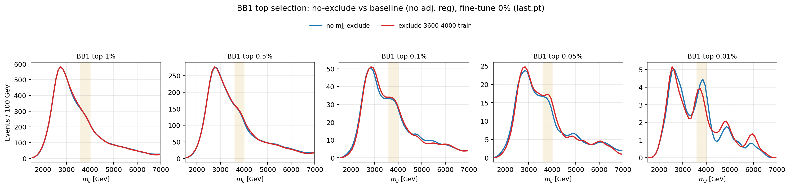

truth decomposition:

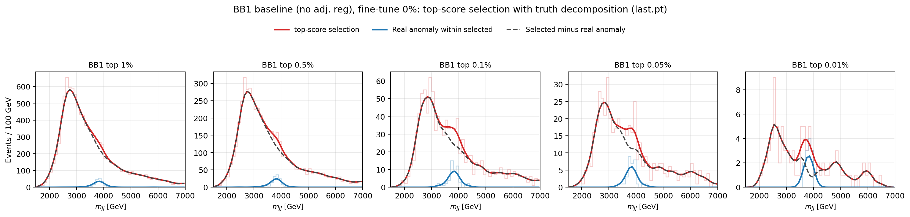

`unique_EB3_sum`:

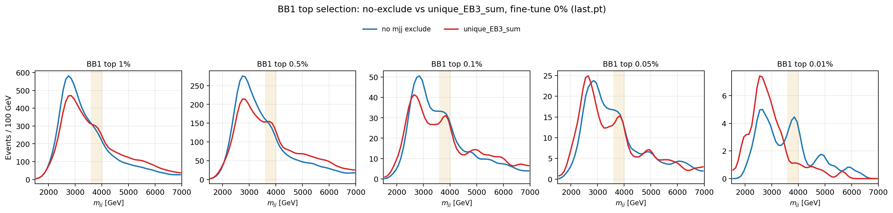

truth decomposition:

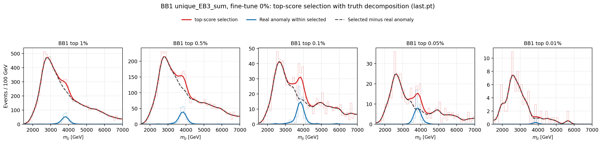

`unique_EB2_sum`:

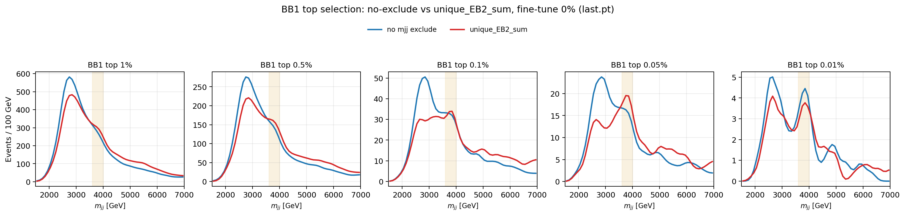

truth decomposition:

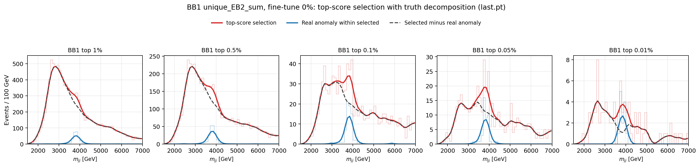

`graph_EB3_sum`:

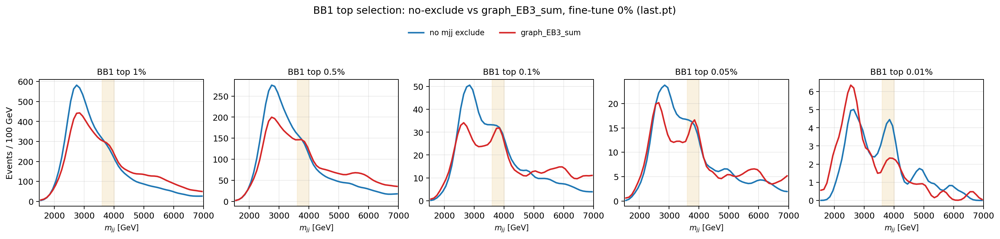

truth decomposition:

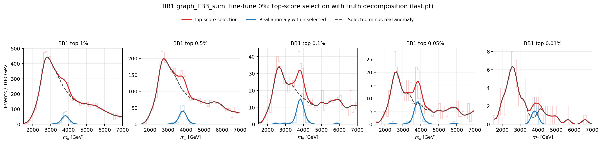

**3% signal**

baseline:

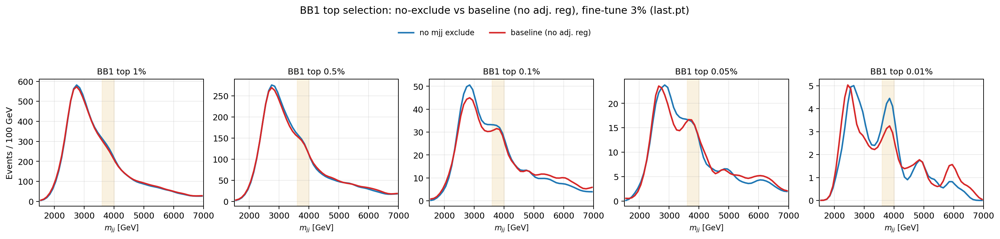

truth decomposition:

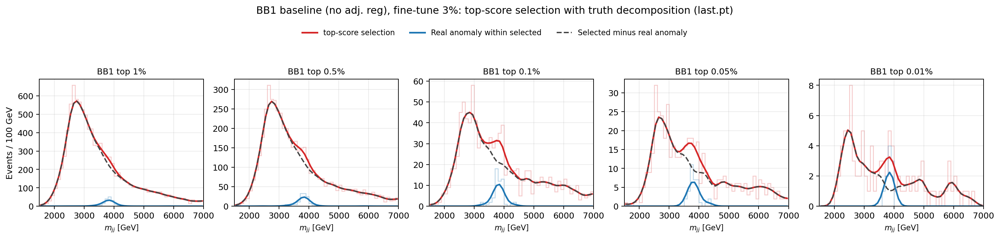

`unique_EB3_sum`:

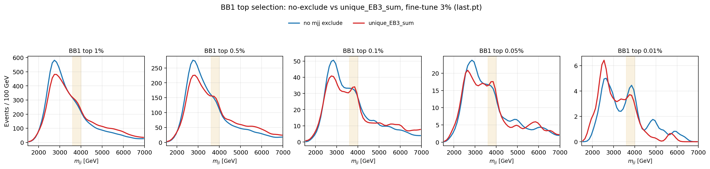

truth decomposition:

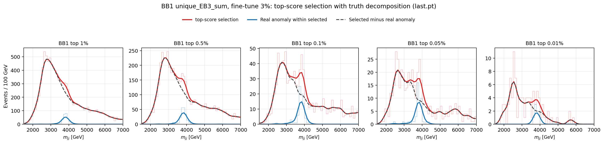

`unique_EB2_sum`:

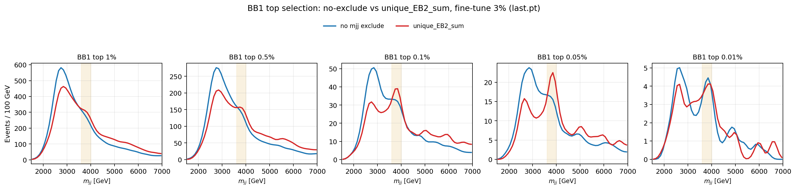

truth decomposition:

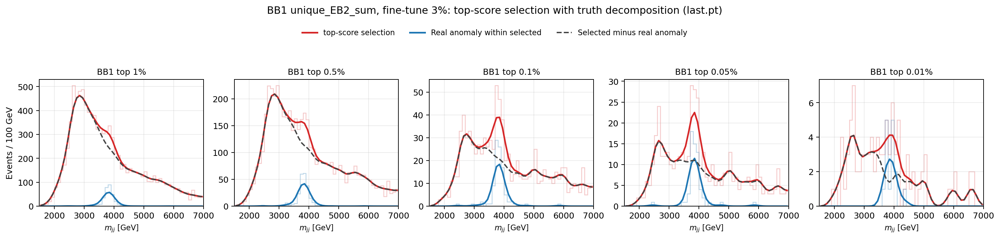

`graph_EB3_sum`:

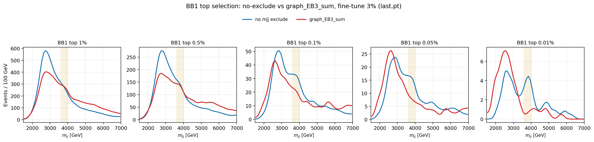

truth decomposition:

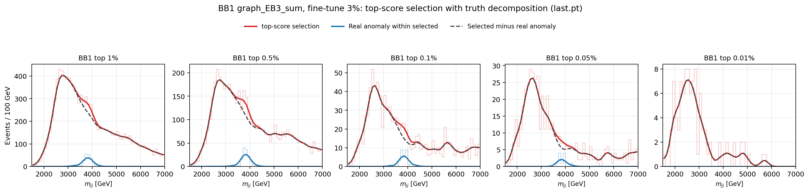


### From-scratch

#### Settings

- Train from random init with the same baseline architecture and data
  splits as the corresponding frozen run (0% or 3% signal).
- Objective: $\mathcal{L}_{\mathrm{recon}}+\lambda\mathcal{R}$ with
  $\lambda=1$, 50 epochs, OneCycle, `last.pt` for metrics.
- Train/val curves below show **reconstruction** loss only; monitor AUROC
  is diagnostic.

#### Training curves

Figure: [`figs/topo_fromscratch_loss_auroc.png`](figs/topo_fromscratch_loss_auroc.png)

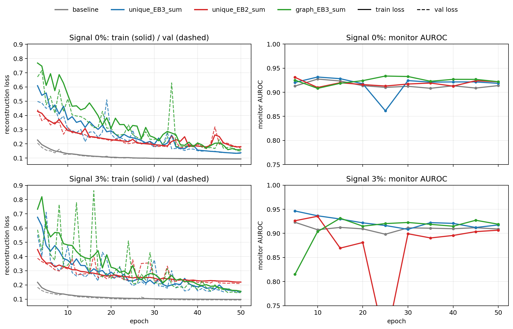

#### LHCO


| Regularizer            | Signal % | AUC   | MaxSIC | $\varepsilon_S$ @ $10^{-2}$ |
| ---------------------- | -------- | ----- | ------ | --------------------------- |
| baseline (no adj. reg) | 0%       | 0.910 | 2.32   | 0.198                       |
| baseline (no adj. reg) | 3%       | 0.907 | 2.26   | 0.189                       |
| `unique_EB3_sum`       | 0%       | 0.916 | 2.55   | 0.228                       |
| `unique_EB3_sum`       | 3%       | 0.917 | 2.58   | 0.234                       |
| `unique_EB2_sum`       | 0%       | 0.919 | 2.80   | 0.270                       |
| `unique_EB2_sum`       | 3%       | 0.906 | 2.32   | 0.173                       |
| `graph_EB3_sum`            | 0%       | 0.919 | 2.66   | 0.242                       |
| `graph_EB3_sum`            | 3%       | 0.918 | 2.63   | 0.233                       |


#### BB1


| Regularizer            | Signal % | AUC   | MaxSIC | $\varepsilon_S$ @ $10^{-2}$ |
| ---------------------- | -------- | ----- | ------ | --------------------------- |
| baseline (no adj. reg) | 0%       | 0.891 | 2.40   | 0.236                       |
| baseline (no adj. reg) | 3%       | 0.885 | 2.34   | 0.222                       |
| `unique_EB3_sum`       | 0%       | 0.913 | 3.32   | 0.312                       |
| `unique_EB3_sum`       | 3%       | 0.916 | 3.56   | 0.320                       |
| `unique_EB2_sum`       | 0%       | 0.913 | 3.57   | 0.321                       |
| `unique_EB2_sum`       | 3%       | 0.899 | 2.63   | 0.198                       |
| `graph_EB3_sum`            | 0%       | 0.917 | 3.55   | 0.330                       |
| `graph_EB3_sum`            | 3%       | 0.917 | 3.58   | 0.338                       |

Same overlay + truth-decomposition plots as fine-tune.

**0% signal**

`unique_EB3_sum`:

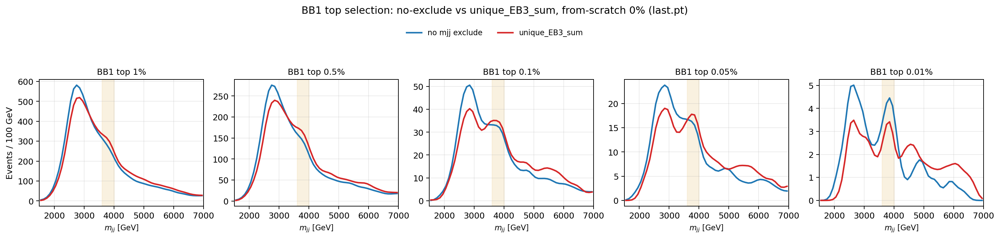

truth decomposition:

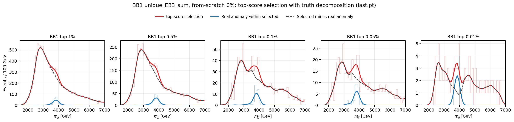

`unique_EB2_sum`:

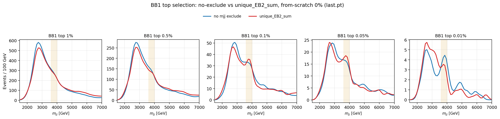

truth decomposition:

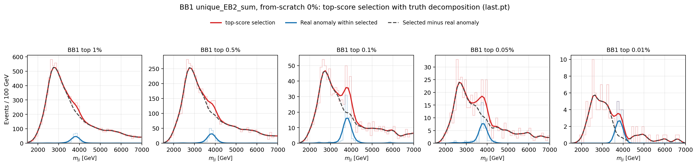

`graph_EB3_sum`:

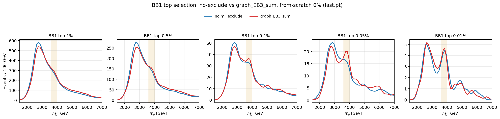

truth decomposition:

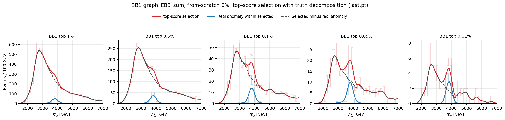

**3% signal**

`unique_EB3_sum`:

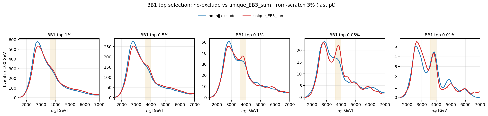

truth decomposition:

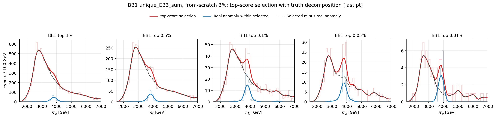

`unique_EB2_sum`:

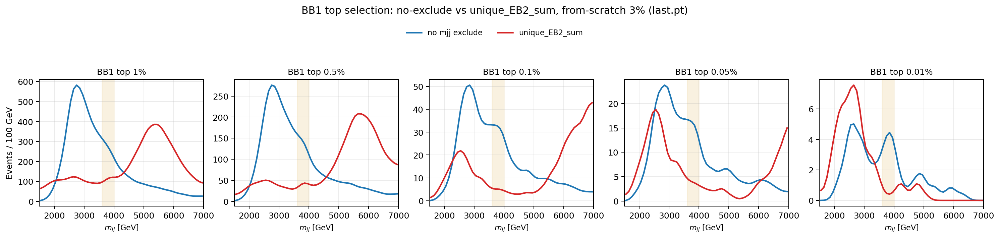

truth decomposition:

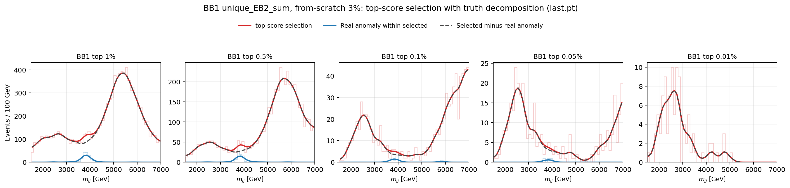

`graph_EB3_sum`:

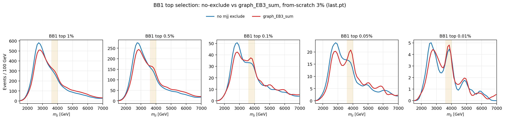

truth decomposition:

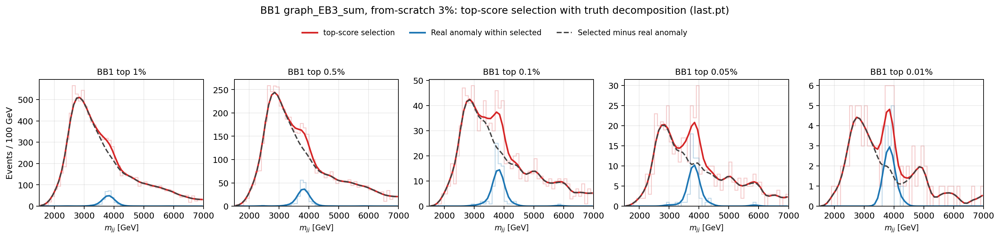

